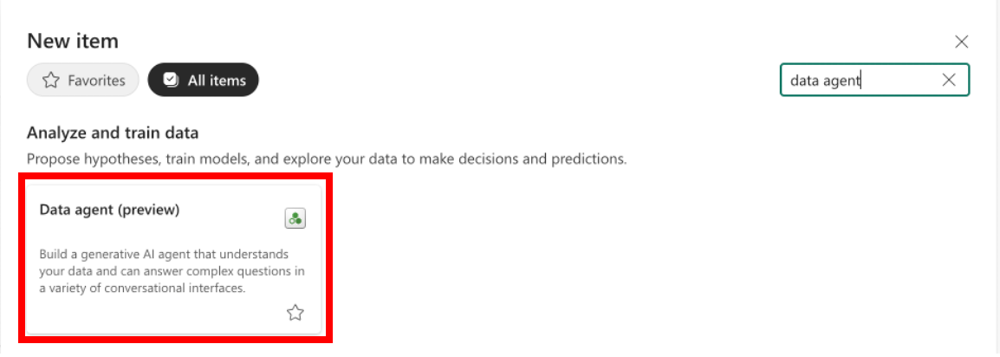

# Workspace, Warehouse 생성

이 문서는 Microsoft Fabric에서 Workspace와 Warehouse를 생성하는 사전 단계에 대해 설명합니다. 아래 단계에 따라 실습을 진행하세요.

## 1. Workspace 생성


- **Synapse Data Engineering** 메뉴에서 좌측 하단의 `+ New workspace` 버튼을 클릭하여 새로운 Workspace를 생성합니다.

## 2. Workspace 설정


- Workspace를 생성한 후, `Workspace settings`에서 Spark 환경을 설정할 수 있습니다.
- `Spark settings` 메뉴에서 `Environment` 탭을 선택합니다.
- `Runtime Version`에서 원하는 Spark 버전을 선택합니다.
  - 예시: `1.3 Experimental (Spark 3.5, Delta 3 OSS)` 등

## 3. Data Warehouse 생성


- Workspace 내에서 상단의 `+ New` 버튼을 클릭합니다.
- 드롭다운 메뉴에서 `Warehouse`를 선택하여 Warehouse를 생성할 수 있습니다.
- 생성된 Warehouse는 Workspace 내에서 확인할 수 있습니다.

## 4. SAS 키를 사용한 데이터 복사

- **LabFiles**: `LabFiles\Data-Warehouse`
- **대상**:
  - Warehouse
  - 테이블: `dbo.answers`
- **소스**:
  - Azure DataLake Gen2
  - 테이블: `dbo.answers`

### SQL 쿼리 예제


```sql
--CREATE TABLE
dbo.answers (
    questionId bigint NULL,
    question varchar(500) NULL,
    connectionId varchar(100) NULL,
    userAgent varchar(100) NULL,
    answerId int NULL,
    answer varchar(2000) NULL,
    responseTime smallint NULL,
    createdAt date NULL
)
GO

--DATA COPY
COPY INTO dbo.answers
```
결과: 3,000,000개의 행이 성공적으로 복사되었습니다.

## 5. Data Pipeline을 활용한 데이터 적재

### 대상
- **Warehouse**
- **테이블**: dbo.sales_transactions

### 소스
- **Azure SQL Database**
- **테이블**: dbo.sales_transactions

1. **New Data Pipeline 생성**
   - Workspace로 이동하여 "New data pipeline"을 선택합니다.

      

2. **연결 설정**
   - "Create new connection"을 선택하고 서버 이름, 데이터베이스 이름, 인증 정보를 입력합니다.
   

3. **데이터 소스 연결**
   - 테이블을 선택하고 데이터를 미리 봅니다.
   
   

4. **데이터 대상 연결**
   - 새 테이블로 로드하고 열 매핑을 설정합니다.
     
   

5. **Pipeline 실행 ID 확인**
   - 실행 ID와 활동 상태를 확인합니다.
     
   

### 결과
- `dbo.sales_transactions` 테이블이 Warehouse에 성공적으로 생성되었습니다.
  


## 6. Lakehouse OneLake shourtcut 생성

### 단계
1. **Lakehouse 생성**
   - `workshop_lakehouse_silver` 및 `workshop_lakehouse_gold` 생성
     
   

2. **Add OneLake shortcut**
   - **대상**:
     - `workshop_warehouse`
     - 테이블: `dbo.answers`, `dbo.sales_transactions`
   - **소스**:
     - `workshop_lakehouse_silver`
     - 테이블: `dbo.sales_transactions`
   

3. **데이터 소스 유형 선택**
   - 데이터셋 또는 T-SQL을 사용하여 이 바로 가기에 액세스할 때 호출 항목 소유자의 ID가 사용되어 액세스 권한이 부여됩니다.
   

4. **OneLake shortcut 확인**
   - `workshop_warehouse`에 바로 가기가 성공적으로 생성되었는지 확인합니다.

      

## 7. S3 Shortcut 생성

### 단계
1. **Amazon S3 Shortcut**
   - **LabFiles**: `LabFiles\Connection_info.txt`
   - **대상**:
     - `workshop_lakehouse_silver`
     - 파일: `fabricsparkstore`
   - **소스**:
     - `fabricsparkstore`
     - 파일 이름: `marketing_campaign.csv`
       
   

2. **연결 설정**
   - 새 연결을 생성합니다.
   - 연결 이름: `s3_marketing`
   - 인증 종류: Access Key
     - Access Key ID: `********`
     - Secret Access Key: `********`
       
   

3. **OneLake shortcut 확인**
   - 폴더와 테이블을 검토한 후 바로 가기를 생성합니다.
   - `workshop_lakehouse_silver`에 바로 가기가 성공적으로 생성되었는지 확인합니다.
   

## 8. 파일 업로드

### 단계
1. **S3 바로 가기**
   - **LabFiles**: `LabFiles\Data-Engineering\features.csv`
   - **대상**:
     - `workshop_lakehouse_silver`
     - 파일: `features.csv` (옵션: 폴더 생성)
       
       

2. **업로드 확인**
   - `features.csv` 파일이 `workshop_lakehouse_silver`에 성공적으로 업로드되었는지 확인합니다.
   

## 9. 데이터 마트 생성 (Gold Data)

### 단계
1. **Notebook**
   - **LabFiles**: `LabFiles\Data-Engineering\Travel - Star Schema_SparkSQL.ipynb`
   - Notebook을 Workspace에 Import 합니다.
   

2. **Lakehouse 추가**
   - Notebook에 `workshop_lakehouse_silver` 및 `workshop_lakehouse_gold` 추가
     
   

3. **테이블 확인**
   - `workshop_lakehouse_gold`의 테이블 확인:
     - `dim_customer`
     - `dim_dates`
     - `dim_promotions`
     - `dim_purchase`
     - `dim_supplier`
     - `fact_sale`

4. **SparkSQL 실행**
   - SparkSQL 쿼리를 실행하여 데이터 마트의 테이블을 채웁니다.

## 10. Semantic 모델 생성

### 단계
1. **새 Semantic Model**
   - `workshop_lakehouse_gold`로 이동합니다.
   - "New semantic model"을 선택합니다.
   - 모델 이름: `semantic_model_gold` 입력
   - 관련 테이블 선택:
     - `dim_promotions`
     - `dim_supplier`
     - `dim_customer`
     - `fact_sale`
     - `dim_purchase`
     - `dim_dates`
       
   

2. **Semantic model 열기**
   - Workspace로 이동하여 `semantic_model_gold` 선택
   - "Open data model" 클릭

     

3. **관계 설정**
   - Semantic Model의 테이블 간 관계 정의
   

4. **Semantic Model 확인**
   - Semantic Model이 성공적으로 생성되고 관계가 설정되었는지 확인
   

## 11. Power BI Report

### 단계
   
1. **Semantic Model 및 Power BI Copilot Report 생성**
   -Workspace로 이동하여 Semantic Model `semantic_model_gold` 선택
   - `...` 메뉴를 클릭하고 "Create report" 선택
     
   

2. **데이터 탐색 및 Copilot을 사용한 보고서 생성**
   - Copilot을 사용하여 데이터 분석 및 탐색
   - 다음과 같은 인사이트 페이지 생성:
      - 고객 행동 인사이트
      - 공급자 서비스 평가
      - 프로모션 효과 추적
   

3. **Power BI Desktop**
   - Power BI Desktop에서 보고서를 열어 추가 사용자 지정 및 시각화
   

### 결과
- 고객 행동, 공급자 성과 및 프로모션 효과에 대한 인사이트가 포함된 여행 분석 보고서가 성공적으로 생성되었습니다.

# DataAgent (Optional)

DataAgent는 데이터 소스를 관리하고 에이전트를 생성할 수 있는 도구입니다.

## 주요 기능

### 1. 워크스페이스에서 데이터 에이전트 생성
Workspace > + New Item > data agent를 선택하여 새로운 데이터 에이전트를 생성할 수 있습니다.



**단계:**
- Workspace에서 + New Item 선택
- "data agent" 검색 및 선택
- "Data agent (preview)" 옵션을 통해 AI 기반 데이터 분석 및 예측 모델을 생성

### 2. 데이터 에이전트 이름 지정
데이터 에이전트 생성 시 고유한 이름을 설정합니다.


**예시:**
- 에이전트 이름: "Demo-Agent"
- Create 버튼을 클릭하여 에이전트 생성 완료

### 3. 데이터 소스 관리 및 에이전트 테스트
Lakehouse의 골드 데이터를 활용하여 에이전트에 데이터 소스를 추가하고 테스트할 수 있습니다.


**주요 기능:**
- **데이터 소스 연결**: workshop_lakehouse_gold와 같은 골드 레이어 데이터 활용
- **다양한 데이터 타입 지원**: 
  - dim_customer (고객 차원 데이터)
  - dim_dates (날짜 차원 데이터)
  - dim_promotions (프로모션 차원 데이터)
  - dim_purchase (구매 차원 데이터)
  - dim_supplier (공급업체 차원 데이터)
  - fact_sale (판매 팩트 데이터)
- **에이전트 응답 테스트**: 
  - "What are the historical trends across all my data?" 
  - "Analyze recent data for any outliers"
  - "Show me the details for a specific subcategory of data"
- **실시간 상호작용**: 자연어로 데이터에 대한 질문을 하고 AI 기반 분석 결과 확인

### 4. Data-Agent에서 전체 데이터 접근
Data-Agent를 통해 연결된 모든 데이터 소스에 접근하여 포괄적인 분석을 수행할 수 있습니다.


**기능:**
- **전체 데이터 탐색**: workshop_lakehouse_gold의 모든 테이블 접근
  - dim_customer, dim_dates, dim_promotions, dim_purchase, dim_supplier, fact_sale
- **통합 데이터 분석**: 여러 테이블 간의 관계성 분석
- **자연어 질의**: "Ask a question about this data, using your own words" 인터페이스
- **샘플 질문 제공**: 
  - "선택한 테이블의 시간 흐름에 따른 추세를 분석해 주세요."
  - "최근 데이터에서 이상값을 분석해 주세요. 데이터의 흐름을 고려하여 눈에 띄는 값이나 패턴을 식별하고, 그 원인이나 영향에 대해 요약해 주세요."

### 5. Sample Prompt 실행 및 결과 분석
미리 정의된 샘플 프롬프트를 실행하여 데이터 에이전트의 분석 능력을 테스트할 수 있습니다.


**주요 특징:**
- **Sample Questions 기능**: 빠른 테스트를 위한 미리 정의된 질문들
- **실시간 응답**: AI가 생성하는 즉각적인 데이터 분석 결과
- **다양한 분석 유형**:
  - 과거 트렌드 분석 ("What are the historical trends across all my data?")
  - 이상치 탐지 ("Analyze recent data for any outliers") 
  - 세부 카테고리 분석 ("Show me the details for a specific subcategory of data")

**사용 팁:**
- 선택한 테이블의 시각 흐름에 따른 추세를 분석해 주세요
- 최근 데이터에서 이상값을 분석해 주세요. 데이터의 흐름을 고려하여 눈에 띄는 값이나 패턴을 식별하고, 그 원인이나 영향에 대해 요약해 주세요

### 6. Setup > Data Source Instructions 추가
데이터 소스에 대한 상세한 안내와 T-SQL 성능 최적화 지침을 설정할 수 있습니다.

## 📌 데이터 소스 안내
이 데이터는 이미지에서 추출된 테이블입니다. 열 이름과 데이터 형식이 정확하지 않을 수 있으므로, 먼저 각 열의 의미를 파악하고 필요한 경우 데이터 정제를 수행해 주세요. 시간 관련 열이 있다면 이를 기준으로 추세 분석을 수행할 수 있습니다.

### ⚙️ T-SQL 성능 최적화 지침
- 전체 테이블 스캔을 피하고, 가능한 경우 인덱스를 활용할 수 있는 조건을 사용합니다.
- WHERE 절과 GROUP BY 절에서 계산식을 최소화합니다.
- 필요한 열만 SELECT 하여 불필요한 데이터 로드를 줄입니다.
- 데이터가 클 경우 LIMIT 또는 TOP을 활용해 샘플링 분석을 먼저 수행합니다.

이 지침은 쿼리 성능을 높이고, 정확한 분석 결과를 도출하는 데 도움이 됩니다.

### 7. 동일한 Sample Prompte 재실행
동일한 샘플 프롬프트를 재실행하여 일관성 있는 분석 결과를 확인할 수 있습니다.

**재실행 가능한 프롬프트:**
- **선택한 테이블의 시간 흐름에 따른 추세를 분석해 주세요.**
  - 시계열 데이터 분석을 통한 트렌드 파악
  - 계절성 및 주기적 패턴 식별
  - 장기적인 성장/감소 추이 분석

- **최근 데이터에서 이상값을 분석해 주세요. 데이터의 흐름을 고려하여 눈에 띄는 값이나 패턴을 식별하고, 그 원인이나 영향에 대해 요약해 주세요.**
  - 통계적 이상치 탐지
  - 비즈니스 관점에서의 이상 패턴 분석
  - 이상값의 원인 분석 및 비즈니스 영향 평가

**재실행의 장점:**
- 분석 결과의 일관성 검증
- 데이터 변화에 따른 분석 결과 비교
- AI 모델의 안정성 확인

### 8. Example Query 예시
데이터 분석을 위한 실용적인 T-SQL 쿼리 예시들을 제공합니다.

#### 8.1 구매 금액(fact_sale.purchase_amount)의 월별 추세
```sql
SELECT
    d.calendar_year,
    d.month_of_year,
    d.calendar_month,
    SUM(f.purchase_amount) AS total_purchase_amount,
    SUM(f.purchase_amount) - LAG(SUM(f.purchase_amount)) OVER
    (ORDER BY d.calendar_year, d.month_of_year) AS monthly_change
FROM
    dbo.fact_sale f
INNER JOIN
    dbo.dim_dates d
    ON f.date_id = d.date_id
GROUP BY
    d.calendar_year,
    d.month_of_year,
    d.calendar_month
ORDER BY
    d.calendar_year,
    d.month_of_year;
```

#### 8.2 고객 수의 연도별 변화(dim_customer)
```sql
SELECT
    YEAR(customer_since) AS calendar_year,
    COUNT(*) AS total_customers,
    COUNT(*) - LAG(COUNT(*)) OVER (ORDER BY YEAR(customer_since))
    AS yearly_change
FROM
    dbo.dim_customer
GROUP BY
    YEAR(customer_since)
ORDER BY
    calendar_year;
```

#### 8.3 프로모션 코드별 할인율의 분기별 변화(dim_promotions)
```sql
WITH PromotionQuarters AS (
    SELECT
        promotion_code,
        web_discount,
        phone_discount,
        mobile_discount,
        DATEPART(YEAR, promotion_start_date) AS promo_year,
        DATEPART(QUARTER, promotion_start_date) AS promo_quarter
    FROM
        dbo.dim_promotions
)
SELECT
    promotion_code,
    promo_year,
    promo_quarter,
    AVG(web_discount) AS avg_web_discount,
    AVG(phone_discount) AS avg_phone_discount,
    AVG(mobile_discount) AS avg_mobile_discount
FROM
    PromotionQuarters
GROUP BY
    promotion_code,
    promo_year,
    promo_quarter
ORDER BY
    promotion_code,
    promo_year,
    promo_quarter;
```

**쿼리 활용 팁:**
- 월별 추세 분석: LAG() 함수를 사용하여 이전 월 대비 변화량 계산
- 연도별 변화 추적: 고객 가입 날짜를 기준으로 연도별 고객 증가 추이 분석
- 분기별 프로모션 분석: CTE(Common Table Expression)를 활용한 복합 분석

### 9. 자연어를 활용한 NLP 기능 테스트 진행
DataAgent의 자연어 처리(NLP) 기능을 테스트하여 AI의 언어 이해 능력을 검증할 수 있습니다.

**NLP 테스트 시나리오:**
- **복합 질문 처리**: 여러 조건이 포함된 복잡한 질문 분석
  - 예시: "2023년 상반기 중 웹 할인율이 10% 이상인 프로모션에서 발생한 총 매출액을 월별로 보여주세요"
  
- **맥락 이해 테스트**: 이전 대화 맥락을 고려한 연속 질문
  - 예시: "그 중에서 가장 높은 매출을 기록한 월은 언제인가요?"
  
- **동의어 및 유사 표현 처리**: 같은 의미의 다양한 표현 방식 테스트
  - 예시: "매출", "판매액", "구매금액", "수익" 등의 동의어 처리
